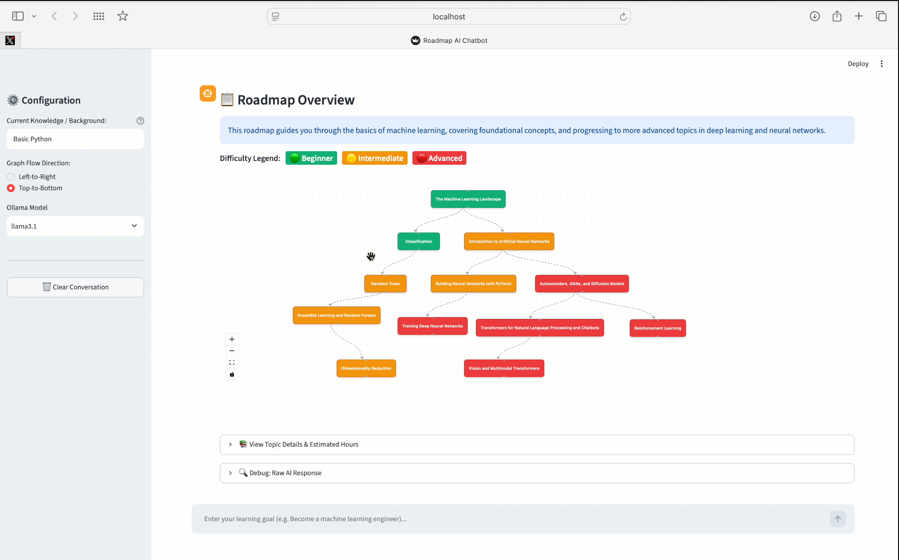

# 🗺️ Roadmap AI

Generate interactive, visual learning roadmaps locally using open-weight LLMs.

Turns a vague goal like _"I want to become a machine learning engineer"_ into a directed graph of topics, showing exactly which concept unlocks the next. Built for anyone stuck in tutorial hell who just wants to know: _"What should I learn next?"_

## ✨ Features

- **100% Local & Offline:** Runs entirely on your machine using Ollama. No API keys, no data leaving your laptop.
- **Interactive Graphs:** Drag, zoom, and pan through your roadmap (powered by React Flow).
- **Smart Dependencies:** Validates the LLM output as a Directed Acyclic Graph (DAG) to ensure proper prerequisite ordering.
- **Tailored to You:** Tell it what you already know, and it will skip the basics and focus on what you actually need to learn.
- **Color-Coded Difficulty:** Beginner (🟢), Intermediate (🟡), and Advanced (🔴) nodes.

## 🛠️ Tech Stack

- **LLM:** `llama3.1` via [Ollama](https://ollama.com/)
- **Frontend:** [Streamlit](https://streamlit.io/)
- **Graph Visualization:** [`streamlit-flow`](https://github.com/dkapur17/streamlit-flow) (React Flow)
- **Graph Logic:** [NetworkX](https://networkx.org/)

## 🚀 Getting Started

### Prerequisites

1. **Python 3.9+** installed on your machine.
2. **Ollama** installed. ([Download here](https://ollama.com/download))
3. Pull the required model:
   ```bash
   ollama pull llama3.1
   ```

### Installation

1. Clone the repository:

   ```bash
   git clone https://github.com/vahenoorsingh/Roadmap-AI.git
   cd Roadmap-AI
   ```

2. Create a virtual environment (optional but recommended):

   ```bash
   python -m venv venv
   source venv/bin/activate  # On Windows: venv\Scripts\activate
   ```

3. Install the required Python packages:
   ```bash
   pip install -r requirements.txt
   ```

### Usage

1. Make sure Ollama is running in the background.
2. Start the Streamlit app:
   ```bash
   streamlit run app.py
   ```
3. Open your browser to `http://localhost:8501`.
4. Enter your current knowledge in the sidebar, type your goal in the chat, and watch your roadmap appear!

## 📸 Screenshots



## 🤝 Open Source

This project was built for the [Hacktoberfest Weekend Challenge: Build for a Friend](https://dev.to/challenges/hacktoberfest-weekend-2026-10-01).

Open innovation made this project possible. Because the model runs locally via Ollama, it costs nothing to run, works offline, and keeps personal learning goals completely private. The prompt logic is fully exposed and tweakable—you can swap models, change the tone, or adjust granularity without asking a company for permission.

## 📄 License

This project is licensed under the MIT License.
